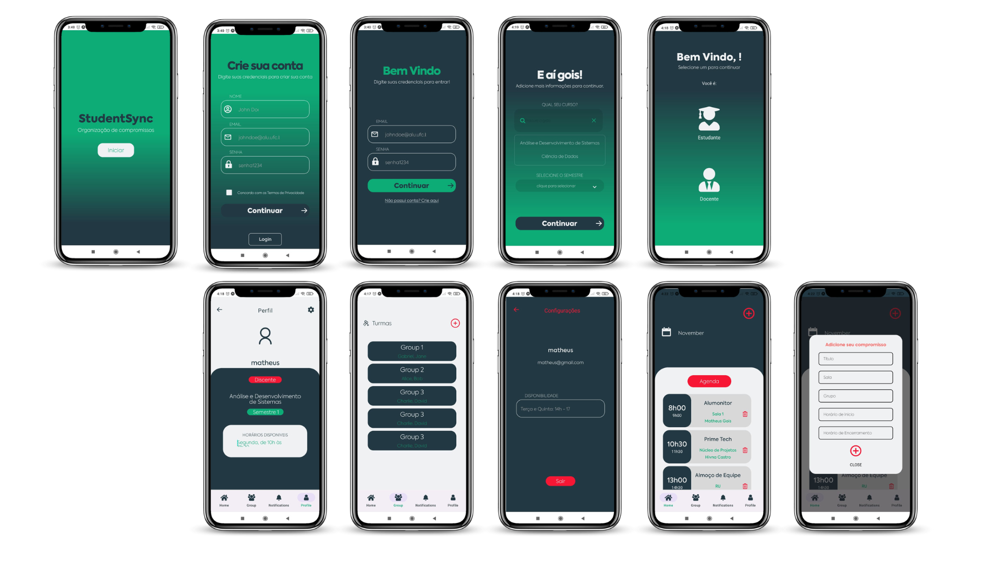

## Sobre
O app do Student Sync foi desenvolvido para dispositivos IOS/Android utilizando a tecnologia React Native juntamente do Expo.

## Bibliotecas
-  -> Utilizado para facilitar ambiente nativo
-  -> Biblioteca para desenvolvimento de apps
-  -> Utilizado para requisições
-  -> Utilizado para navegar
  
## Preview

## Rodando o Projeto
